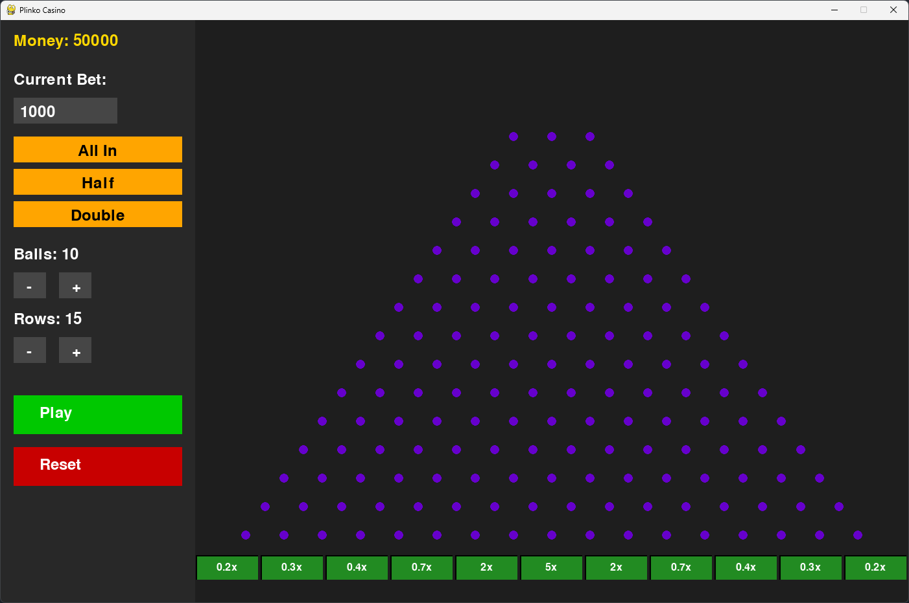

# Plinko Játék - Fizikai Szimuláció Pythonban 🎮

[](https://www.python.org/)
[](https://www.pygame.org/)



Egy egyszerű Plinko játék, amelyet Pythonban készítettem objektumorientált programozással (OOP) és a Pygame könyvtár segítségével. A játék célja, hogy a golyók ütközéseit és leesését valósághűen szimulálja, majd pontszámot számoljon a végén.

## Főbb jellemzők ✨
- **Objektumorientált tervezés**: A játék elemei (golyók, szögek, pálya) osztályokban vannak szervezve.
- **Fizikai szimuláció**: A golyók mozgása gravitációt és ütközéseket modellez.
- **Grafikus felület**: A Pygame könyvtárral készült interaktív megjelenítés.
- **Pontszámítás**: A golyók leesési pozíciója alapján dinamikus pontszám kalkuláció.

## Telepítés és Futtatás 🛠️
1. **Függőségek telepítése**:
   ```bash
   pip install pygame

## Letöltés
```bash
   git clone https://github.com/Mofumimi/Plinko-Project.git
   cd Plinko-Project
